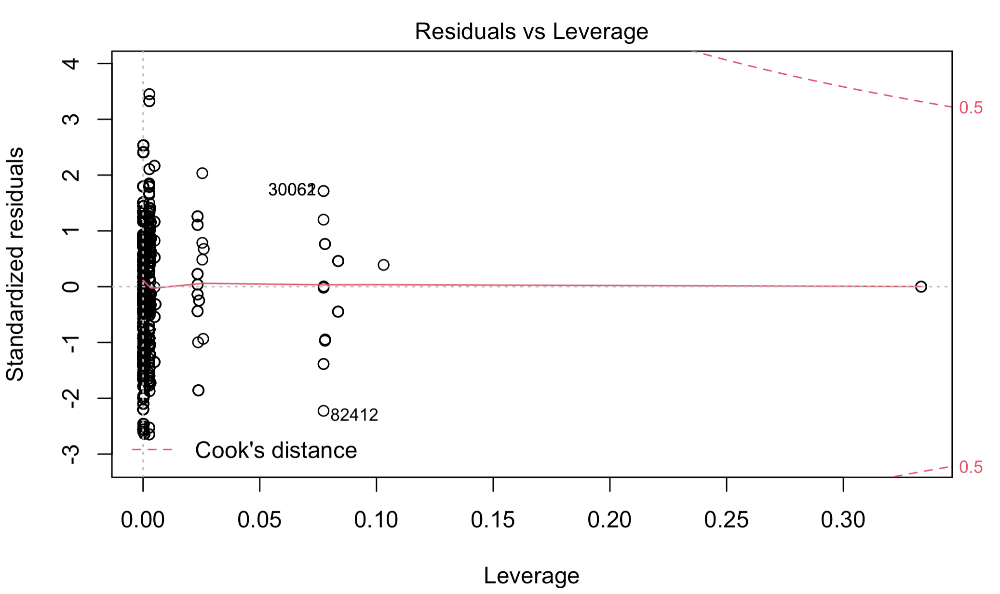

```{r setup, include=FALSE}
# Set global options for output rendering
knitr::opts_chunk$set(echo = F, eval= T, warning = F, message = F, fig.align = "center")

# Set working directory to file path
setwd(dirname(rstudioapi::getSourceEditorContext()$path))

# Set default rounding to 4 decimal places
options(digits = 4)

# Import self-defined custom functions
source("functions.R")
```


```{r "Load libraries", echo=FALSE, eval=T, message=FALSE, warning=FALSE}
# Load required packages
library(summarytools)
library(dplyr)
library(tidyr)
library(purrr)
library(broom)
library(scales)
library(RColorBrewer)
library(ggplot2)
library(knitr)
library(kableExtra)
library(lmtest) # for the BP test

# Set default ggplot theme
theme_set(theme_classic())
```


```{r "Load data", eval=T}
covid <- read.csv("../covid.csv") # impact and hospitalization data
vul <- read.csv("../vulnerability.csv") # community vulnerability data
```


```{r "Munge data", eval=T}
# remove redundant X column
covid <- covid[, -1] 

# subset to Texas
vul_TX <- vul %>% filter(STATE=="TEXAS")

# merge by fips=hospital location
merged_TX <- inner_join(covid, vul_TX, by = c("fips_code"="County.FIPS"))

# take a look at summary stats
# merged_TX %>% dfSummary() %>% view()

# subset variables of interest and rename variables where necessary
merged_TX_sub <- merged_TX %>%
  select(inpatient_beds_7_day_avg, 
         inpatient_beds_used_covid_7_day_avg,
         total_icu_beds_7_day_avg,
         LIA_CS_PP = Low.Income.Area..LIA..County.SAIPE....Poverty.Percentage., 
         LIA_CT_PP = Low.Income.Area..LIA..Census.Tract..Poverty.Percentage.,
         is_metro_micro, HHA_Score = HHA.Score,
         Tribal_Community = Tribal.Community..1.if.yes., 
         Rural_Score = Rural...Score,
         hospital_subtype, city
         )

# Declare variable types
merged_TX_sub <- merged_TX_sub %>%
  mutate(
         # convert all character or integer variables to factors
         across(where(is.character) | where(is.integer), as.factor)
         )

# save(merged_TX_sub, file = "merged_TX_sub.RData")

# Get counties for reporting
# counties <- merged_TX %>% 
#   select(LOCATION) %>%
#   mutate(county = unlist(str_split(LOCATION, ","))) %>%
#   filter(!duplicated(county))
# 
# counties <- map(merged_TX$LOCATION, function(i) {
#   str_split(merged_TX$LOCATION, ",")[[i]][2]
# })
```


# Introduction

In this project, we take a multiple regression approach to try to understand the association between hospital beds capacity and community vulnerabilities. At this stage, we seek to identify the best set of variables including at least one community vulnerability measure and other relevant factors that are able to significantly explain our measure of hospital capacity, **inpatient_beds_7_day_avg**.

## Background and Motivation
<!-- Explain the scientific background and rationale for the investigation being reported -->

Undoubtedly, the COVID-19 pandemic has affected almost every facet of life worldwide.  However, areas such as hospital care units and industries have been tremendously affected. The USA was not left out, many hospitals were filled out leading to a serious shortage of hospital beds, especially for intensive care units (ICUs). As the pandemic rises day by day, hospitals have been overburdened or occupied with victims of the pandemic. In such situations, hospitals in vulnerable communities may be more prone to exceeding hospital beds capacity. For instance, Tsai et al (2022) studied the association of community level social vulnerability with USA acute care hospital intensive care unit capacity during this period of Covid-19 pandemic and found that 63% of hospitals reached critical ICU capacity for at least two weeks during the study period, while the surge of COVID-19 cases appeared to be crowding out non-COVID-19-related intensive care needs, showing how the association between social vulnerability and critical ICU capacity highlights underlying structural inequities in health care access. Again, according to a report by the Office of Inspector General of the U.S. Department of Health and Human Services, hospitals reported that the covid-19 pandemic has significantly strained health care delivery.

Therefore, the need to investigate the nature of the relationship that exists between hospital beds capacity and community vulnerabilities cannot be overemphasized. This has the potential of providing great insights and guidelines to policy and decision makers to help them take necessary actions to prevent strained ICU capacity from compounding COVID-19 inequities. In this report, we conduct a multiple linear regression analysis to investigate whether hospital beds capacity measured by the **inpatient_beds_7_day_avg** variable is associated with community vulnerabilities using data obtained from the U.S. Department of Health and Human Services Protect database. 

<!-- the world continue to grapple with -->

## Objectives	
<!-- State specific objectives, including any prespecified hypotheses -->

Among other things, this report aims to address the following research question.

> **How is hospital capacity associated with community vulnerabilities?**

Using **inpatient_beds_7_day_avg** as a quantifier for hospital capacity, our goal is to identify an appropriate regression model that utilizes the appropriate community vulnerability measure(s) and other relevant factors to explain much of the variability in hospital capacity, while serving as a reliable predictive model. 

<!-- This leads us to the specific objectives described below: -->

<!-- > Is there a linear relationship between a particular hospital capacity measure and any of the community vulnerability measures? If so, which of the community vulnerability measures provides the largest reduction in the variability of the given outcome (hospital capacity measure)? -->

Our initial hypothesis is that the vulnerability measure, ***low income area county poverty percentage***, and a potential confounding variable ***hospital subtypes*** are likely to have the most significant effect on the dependent variable measuring hospital capacity.  

## Setting
<!-- Describe the setting, locations, and relevant dates, including periods of recruitment, exposure, follow-up, and data collection -->

Data for this report span the period from July 15, 2020 to `January 7, 2022` and were collected from selected hospitals in the US as described in the participants section. Part of the population were first recruited on June 1, 2020, with the remaining joining on July 15 the same year. 

## Participants
<!-- Describe participants here -->
Our study participants consists of `r length(unique(merged_TX$hospital_name))` hospital facilities spread across various counties in the State of Texas selected from a hospital population that includes all hospitals registered with Centers for Medicare & Medicaid Services (CMS) as of June 1, 2020 and non-CMS hospitals that have reported since July 15, 2020. It does not include psychiatric, rehabilitation, Indian Health Service (IHS) facilities, U.S. Department of Veterans Affairs (VA) facilities, Defense Health Agency (DHA) facilities, and religious non-medical facilities. Our study, however, focused on a subsection comprising hospitals in the state of Texas.  

## Variables
<!-- Clearly define all outcomes, exposures, predictors, potential confounders, and effect modifiers. Give diagnostic criteria, if applicable --> 
The study focuses on nine variables obtained from a facility-level hospitalization data as well as a community-level vulnerability data. The following table provides information about these variables used in the study. As indicated by the role column of Table 1, our target or response variable is **inpatient_beds_7_day_avg** which serves as a measure of hospital capacity and constitute the seven-day average of the reports provided for a given facility for that element during that collection week, five independent (predictor) variables measuring community vulnerability, and two potential confounding variables, hospital subtype and city. 

<!-- Note that in this phase of the project we decided to model only --- as a function of the other variables. -->

```{r "variable description", eval=T}
# inpatient_beds_used_covid_7_day_avg
col_names <- c("Variable Name", "Description", "Type of Measure", "Data Type", "Role")
data.frame(rbind(
  c("inpatient beds 7 day average" ,"Average number of total number of staffed inpatient beds in your hospital including all overflow, observation, and active surge/expansion beds used for inpatients (including all ICU beds) reported in the 7-day period.", "Hospital bed capacity", "Numeric/continuous", "Outcome/ Response"),
  c("Inpatient beds used covid 7 day average", "Average of reported patients currently hospitalized in an inpatient bed who have suspected or confirmed COVID-19 reported during the 7-day period.", "Hospital bed capacity", "Numeric/continuous", "Outcome/ Response"),
  c("total icu beds 7 day average", "Average number of total number of staffed inpatient ICU beds reported in the 7-day period.", "Hospital bed capacity", "Numeric/continuous", "Outcome/ Response"),
  c("is_metro_micro", "This is based on whether the facility serves a Metropolitan or Micropolitan area. True if yes, and false if no.", "Community vulnerability", "Binary/categorical", "Predictor") ,
  c("HHA/HHA_Score", "Hardest Hit Area Score", "Community vulnerability","Integer/Categorical", "Predictor"),
  c("LIA_CS_PP", "Low Income Area (LIA) County SAIPE Poverty Percentage", "Community vulnerability", "Numeric/continuous", "Predictor"),
  c("LIA_CT_PP", "Low Income Area (LIA) Census Track Poverty Percentage", "Community vulnerability", "Numeric/continuous", "Predictor"),
  c("Rural/Rural_Score", "An indicator of whether the facility is at a rural location or not", "Community vulnerability", "Integer/Categorical", "Predictor"),
   c("Tribal Community", "An indicator of whether the facility is found in a tribal community. Possible values are fully tribal, non−tribal, and partial tribal.", "Community vulnerability", "Character/Categorical", "Predictor"),
  c("Hospital subtype", "The sub-type of the facility reporting. Valid values are: Children's Hospitals, Critical Access Hospitals, Long Term, Psychiatric, Rehabilitation & Short Term.", "-", "Factor/Categorical", "Potential confounder"),
  c("City", "The city of the facility reporting.", "-", "Factor/Categorical", "Potential confounder")
)) %>%
    kable(format="latex", col.names = col_names, linesep="", booktabs = T,
          caption = "Definition of Variables of interest") %>%
  column_spec(1, width = "10em") %>%
  column_spec(2, width = "15em") %>%
  column_spec(3, width = "6em") %>%
  column_spec(5, width = "5em") %>%
       kable_styling(font_size = 10,  latex_options = c("HOLD_position"))
```


## Data sources/measurement

<!-- For each variable of interest, give sources of data and details of methods of assessment (measurement). Describe comparability of assessment methods if there is more than one group -->

The variables listed in the previous section come from two sources; a facility-level hospitalization data and community vulnerability data, both of which were accessed from the US Department of Health and Human Services Protect databases for **COVID-19 Reported Patient Impact and Hospital Capacity by Facility** and **COVID-19 Community Vulnerability Crosswalk - Crosswalk by Census Tract**, respectively. Due to the large volume of the data, only 5009 observations from the hospital capacity data were used. We also limited ourselves to only the averages derived based on the number of values collected for a given hospital in a collection week (Friday to Thursday) to be used as the sole target variable. These observations were then merged with the community-level vulnerability data through the use of an inner join on the Federal Information Processing Standard (FIPS) code of the location of the hospital existing in both data sets. 

<!-- We eventually restricted the scope of the study to the State of Texas which left us with a final data set consisting of **82915** observations. -->

According to the data sources, FCC's scoring procedure was used to weigh the community vulnerability measures including Hardest Hit Area (HHA), Low Income Area, Tribal Community, and Rural Community. We chose the scored variables for phase I of our study because they provide an evaluation of the most vulnerable communities in our population. However, in this second phase of the study we first examined the differences between using the raw versus the scored variables and realized that the choice of one did not impact our results in any way, so we decided to use the raw variables to facilitate easy interpretation of our results.

## Bias
<!-- Describe any efforts to address potential sources of bias -->

<!-- - One source of bias could come from the cases where `Low Income Area County SAIPE Peverty Percentage`, the only continuous predictor variable, emerged as the best independent or predictor variable in our initial modeling for narrowing down to one model per each dependent variable. This is because the overall relationship observed could be different when the sub-populations are considered. To address this potential bias, we considered running other analyses where one of the significant categorical variable was used to split the data into subgroups and refitted the models on the individual subgroups. -->

- We believe that the study data is not representative of the study population since we simply took the first **5009** observations from the hospital capacity dataset as a way of obtaining a manageable sample size. This source of bias can be addressed by taking a good random sample from the large hospital capacity data from the original source, but this was clearly beyond our control.

<!-- - Data suppression  -->

- There is a high potential for our final model to overfit the data set used to build the model. To guard against this phenomenon, we employed a cross-validation procedure where the full data set was partitioned into a training set for training the model and a validation set for assessing the reasonableness and predictive ability of the final selected model.

- Another potential source of bias is the high level of class imbalance seen in the distribution of the categorical predictors. Some levels of all these four qualitative measures, `HHA_Score`, `Rural Score`, `Tribal Community`, `is_metro_micro`, and `hospital subtype`, are disproportionately represented. This can lead to a serious problem where our findings would be unfairly biased towards a particular subgroup.  After consultation with our project advisor in the person of Dr. Amy Wagler, it was decided that the treatment of class imbalance is beyond the scope of the project, so we did not address this potential source of bias in this second phase of the study.

## Study size
<!-- Explain how the study size was arrived at -->
There were $761,663$ observations in the original merged data provided for the analysis. Limiting the study to the State of Texas brought the number of observations down to $82,915$.  We then removed missing data arising from data suppression that was applied to hospital capacity average measures less than four (4) by the maintainers of the data and non-reporting by some of the facilities. Please see the Missing Data section in Section 2 for what we considered to be non-reported values. In the end, the data used for the analysis had $45797$ observations making up our study size.


## Statistical methods
<!-- Describe all statistical methods, including those used to control for confounding   -->
### Regression model and Assumptions

The main statistical method used in this project is the multiple regression model

 $Y_{i}=\beta_{0}+\beta_{1}X_{i1}+\beta_{2}X{i2}+\beta_{3}X_{i3}+\hdots +\beta_{p-1}X_{ip-1}+\epsilon_{i}$ where 
 \begin{itemize}
 	\item{}
 	The parameters are $\beta_{j}$  where $j=0,1,2, \hdots, p-1$
  \item{}
 $\epsilon_{i}$ are independent $N(0,\sigma^{2})$
 \item{}
 $X_{ij}$ denotes the $jth$ independent variable for $i=1, \hdots ,n$.
 \item{}
 $\beta_{j}$ measures the effect $X_{j}$ has on the independent variable $Y$
 Note that $ X_{j}=X_{ij} $.
 \item{Generally the Multiple linear Regression can be represented in matrix form as:}
 
 $$Y_{nxn} =X'_{n\times p}\beta_{p\times 1}+\epsilon_{n\times 1}$$ 
 
 where 
 
 $\left[ {\begin{array}{c}
 Y_{1}\\
 Y_{2}\\
 \vdots\\
 Y_{n}
 \end{array}} \right]$, $\left[ {\begin{array}{ccc}
     1 & X_{11} & X_{12} \hdots X_{1n}\\
     1 & X_{11} & X_{12} \hdots X_{1n}\\
\vdots &\vdots & \vdots  \hdots \vdots \\
 	1 & X_{n1} & X_{n2} \hdots X_{np}\\
 \end{array}} \right]$,
$\left[ {\begin{array}{c}
		\beta_{0}\\
		\beta_{1}\\
		\vdots\\
		\beta_{p-1}
\end{array}} \right]$, 
$\left[ {\begin{array}{c}
		\epsilon_{1}\\
		\epsilon_{2}\\
		\vdots\\
		\epsilon_{n}
\end{array}} \right]$,

 \end{itemize}

 We check for the following assumptions.
 \begin{itemize}
	\item{}
	There must be a linear relationship between the outcomes(dependent) variables and the independent variables: We use the scatter plot to check for this linear relationship. 
	\item{}
Multivariate  Normality: Multiple regression assumes that the residuals are normally distributed.
	\item{}
No Multicollinearity: Multiple regression assumes that the independent variables are not highly correlated with each other.We test this assumption using the Variance Inflation factor(VIF) values.
\item{}
Homoscendasticity: This assumption states that the variance of error terms are similar across the values of the independent variables: Plotting the standardized residual versus the predicted shows us whether the points are equally distributed across all values of the independent variables. 
\end{itemize}
\subsubsection{Effect Of Multicollinearity}
Multicollinearity occurs when there is correlation between independent variables in a regression model, this is a problem because as seen in the assumptions above the independent variables should be independent,but if the  degree  of the correlation between variables is high enough, it can cause problems when fitting the moideland interpreting the results. This is because our key goal for this analysis is to isolates the relationship between each independent variable and dependent variable.

Therefore the interpretation of the regression coefficients is it that it represents the mean change in the dependent variable for every one unit change in an independent variable when we hold all of the other independent variables constant. Therefore it becomes very difficult for the model to estimate the relationship between each independent variable and the dependent variable independently because the independent variables tend to change in unison.

<!-- The main statistical method used here is simple linear regression. Under this method, we have the general model $Y_i = \beta_1X_i + \beta_0 + \epsilon_i$, $i = 1, \cdots, n$, where $n$ is the sample size and $\epsilon_i$ is normally distributed with mean zero and variance $\delta^2$. Under this model, we check the following assumptions: -->


<!-- 1. Constancy of the error variance. This was checked by using Breusch Pagan test -->

<!-- 2. Normality of the error variance. This was checked using the normal probability plot and the Normal QQ plot. -->

<!-- 3. Linearity of the model. This was checked using the scatter plot and the residual versus fitted plot -->

<!-- 4. Normality of the residuals using coefficient of correlation between the ordered residuals and their expected values under normality. -->

<!-- 5. Check the significance of the slope and intercept using confidence intervals of the slope and the intercept. -->

### Model Selection

The data source presented to us with numerous variables that could serve as potential predictors. Obviously, using all available variables will amount to a needlessly complex model. Thus, after choosing the important measure of hospital capacity to model, we critically assessed each one of the community vulnerability measures based on information we gathered about them in order to ascertain whether they could form part of our initial predictor set. Six variables, `LIA_CS_PP`, `LIA_CT_PP`, `HHA`, `is_micro_metro`, `tribal community`, and `rural` stood out tall. In addition, we searched our data for variables that were not direct determinants of community vulnerabilities but could potentially influence our model and settled on the `hospital subtype` and the `city` variables. This brought our predictor set to eight variables, to start with. Subsequently, a backward stepwise regression procedure was employed to help us narrow down our predictor set to the "best" subset of variables. Finally, using the final model reported by the automatic search procedure as a baseline model, we tried several other combinations of variables already in the model and those that were dropped including their interactions to arrive at our final model. It is noteworthy that our personal judgment guided by the goal of obtaining a more explanatory model played a key role in this pursuit. By and large, we were inspired by Kutner et al. (2004)'s remarks that "Judgment needs to play an important role in model building for exploratory studies. Some explanatory variables may be known to be more fundamental than others and therefore should be retained in the regression model if the primary purpose is to develop a good explanatory model".

### Model Assessement


We diagnosed the appropriateness of our models using diagnostic plots such as the residual versus fitted plots, normality plots as well as numerical tests including `Bruesch-Pagan` test for non-constancy of error variance, and the `coefficient of correlation` test for normality. We used the plot of the Residual versus Leverage to check the existence of any outliers and any possible influential observations. We also, checked the linear relationship assumption with the residual versus fitted plot as well as the \textbf{Added-Variable Plots}, both the response variable \textbf{inpatient_beds_7_day_avg} and the predictor variables were all regressed against each other predictor variables which were already in our model. We obtained the residuals for each. The plot of the residuals against the other set showed that there was a marginal contribution of the candidate. This was done largely to ensure that the various assumptions required for linear regression model listed above were reasonably satisfied.  We therefore relied on the these diagnostics to select our final model.

To check the multicollinearity between our predictor variables we used the variance inflation factor (VIF). We calculated the VIF value for each predictor variables start and realized they were all below 10, suggeting the absence of multicollinearity.

Other performance metrics such the coefficient of determination ($R^2$) and the mean squared error (MSE) were also utilized.
The R-squared (coefficient of determination)  is used to determine the amount of  variability in the dependent/response that is accounted for by the regression model.


### Model Validation

To be able to validate our candidate selected model, both internally and externally, we used a holdout sample to check the model and its predictive ability or the tendency of the model to generalize well to new, unseen data. As a result, we split  the data set into 70% training set and 30% testing set corresponding to **32061** and **13736** training and validation samples, respectively. Given our large sample size, this partition ensured a sufficiently large model-building data set to ensure the development of a reliable model. 

We compute mean squared prediction error as follows: 
$$\text{MSPR} = \frac{\sum_{i=1}^{n_v}(Y_i - \bar{Y})^2}{n_v}$$
where:

$Y_i$ is the observation of the response variable in the $i^{th}$ validation case

$\bar{Y}$ is the predicted value for the $i^{th}$ validation case based on the model-building data set.

$n_v$ is the number of observations in the validation or test set.


> All analyses were performed in the R Statistical Software version 4.0.2 (2020-06-22).


# Analysis and Results

 In this section, we present key results from our exploratary data analysis as well as the regression modeling procedures.
 
## Descriptive data	
<!-- Give characteristics of study participants available, information on exposures and potential confounders, and any missing data -->

We begin our analysis by providing both numerical summaries and graphs to enhance our understanding of the underlying data for the study.

### Characteristics of study participants

As already identified in the introduction, our study participants consist of all hospitals in Texas registered with Centers for Medicare & Medicaid Services (CMS) as of June 1, 2020 and non-CMS hospitals that have reported since July 15, 2020. The graphs below provides information about how these participants are distributed in terms of hospital subtypes and cities.

```{r}
participants_info <- merged_TX %>% 
  select(hospital_name, hospital_subtype, city, address) %>%
  mutate(across(everything(), factor)) # c(hospital_name, hospital_subtype, city)

# summary(participants_info)

mybarplot(hospital_subtype, title = "Representation of hospital sub types", dat = participants_info)
```
Here, we also see unequal representation with critical access hospitals being low as expected.


```{r}

city_sum <- participants_info %>%
  group_by(city) %>%
  summarise(n = n()) %>%
  mutate(is_highest = as.factor(ifelse(n == max(n), 1, 0))) %>%
  top_n(10, n)

ggplot(city_sum, aes(x=reorder(city, -n), y=n)) +
  geom_bar(aes(fill=is_highest),stat = "identity") +
  scale_fill_manual(values=c("dodgerblue","tomato")) +
  geom_text(aes(label= n, size=0.4), hjust= 0.5, vjust=1, color="lightgray") +
  theme_classic() +
  labs(x="", y="Number of hospitals",
       title="Top 10 out of 254 cities  where the hospitals are located ") +
  theme(legend.position = "none",
        panel.grid.major = element_blank(),
        panel.grid.minor = element_blank(),
        axis.text.x = element_text(angle = 90, vjust = 0.5, hjust=1)) 


```

Most of the participating hospitals come from Houston, followed by Dallas with the city of El Paso coming last on the list. This may not be a fair representation since the populations at these cities differ greatly from each other. Hence, the population of these cities needs to be taken into account when interpreting the figures.

### Investigating missing data


```{r "EDA missing values", eval=T}
# install.packages("naniar")
# install.packages("UpSetR")
library(naniar)
library(UpSetR)

# explore the patterns
# gg_miss_upset(merged_TX_sub) # shows interractions

# explore missingness in variables with gg_miss_var
miss_var_summary(merged_TX_sub) %>% 
  kable(format="latex",booktabs = T, caption = "Missing values in the merged data set") %>%
      kable_styling(font_size = 10,  latex_options = c("HOLD_position"))

# gg_miss_var(merged_TX_sub) + ylab("Number of missing values")

dependent_vars <- covid %>%
  select(inpatient_beds_used_covid_7_day_avg,total_icu_beds_7_day_avg,inpatient_beds_7_day_avg)

miss_var_summary(dependent_vars) %>% 
  kable(format="latex",booktabs = T,caption = "Missing values in dependent variables from the covid data before merge") %>%
      kable_styling(font_size = 10,  latex_options = c("HOLD_position"))

# gg_miss_var(dependent_vars) + ylab("Number of missing values")
```

We see from **Table 2**  that only the three independent variables have missing values. It turns out that most of the missing values were created by the data merge between the hospital capacity data and the community vulnerability data as revealed by **Table 3**. We take a very simplistic approach of **deleting the missing values** as a means of treatment since most of the missing values are artificial. Again, it is important to note that the actual missing values denote averages that were less than 4.


#### Non-reported values in dependent variables

We also observed that the hospital capacity measures chosen for our dependent variables had zeros (0) in them. This was quite surprising at first because we did not expect to see zeros in these variables when the maintainers of the data ***suppressed all averages less than four (4) and replaced them with `-999,999`*** which were then marked as missing values in our version of the data. After digging deeper we realized that these zeros could represent non-reported values by some of the facilities since our data source stated that "No statistical analysis is applied to impute non-response". By this reasoning and the fact that there was no information to determine the reasons leading to non-responses, we decided to represent zeros (0) in our dependent variables as missing values and treated them in the same way as described above.


### Distribution of dependent variables
```{r "distributions of dependent", eval=T}
library(patchwork)

# Histogram of the dependent variables
my_histogram <- function(y_var, dat = NULL){
  ggplot(dat, aes({{y_var}}, fill={{y_var}})) +
  geom_histogram(fill="green", color="red") +
  ylab("Frequency") +
  theme_classic()
}
a <- my_histogram(inpatient_beds_used_covid_7_day_avg, dat = merged_TX_sub)
b <- my_histogram(inpatient_beds_7_day_avg, dat = merged_TX_sub)
c <- my_histogram(total_icu_beds_7_day_avg, dat = merged_TX_sub)

a + b + c

```

The distributions of all three dependent variables are identical and heavily right skewed. There also appears to be outliers. The skewness suggests that one of two transformations, logarithm, and a power transformation (square root or cube root), might be appropriate. We learn from these distributions that similar results may be obtained from modeling the variables.

### Distribution of independent variables
```{r "distributions of independent", eval=T}
par(mfrow = c(2,2))
ggplot(merged_TX_sub, aes((LIA_CS_PP))) +
  geom_freqpoly(color = "blue") # the only continuous predictor variable

d <- mybarplot(Rural_Score, dat = merged_TX_sub)

e <- mybarplot(Tribal_Community, dat = merged_TX_sub)


f <- mybarplot(HHA_Score, dat = merged_TX_sub)

g <- mybarplot(is_metro_micro, dat = merged_TX_sub)

(d + e) / (f + g) # uses the patchwork package syntax to display plots side by side
```

The distribution of the continuous independent/predictor variable, `Low Income Area County SAIPE Poverty Percentage` (LIA_CS_PP), looks multimodal and right skewed with some possible outliers at the extreme ends. This measurement appears to have come from two underlying sub-populations as portrayed by the two high peaks.

Turning our focus to the categorical independent variables, we observe that some of the levels of each variable are extremely disproportionately represented. This is a clear sign of class imbalance which would have to be dealt with appropriately in the modeling phase in order to avoid any potential bias.


### Effect of independent variables on the dependent variables

```{r "scatterplots", eval=T}
((ggplot(merged_TX_sub, aes(LIA_CS_PP, inpatient_beds_7_day_avg, color = HHA_Score)) +
  geom_point() +
   theme(legend.position = "none")) +
  (ggplot(merged_TX_sub, aes(LIA_CS_PP, inpatient_beds_7_day_avg, color = Rural_Score)) +
  geom_point() + ylab("") + scale_color_manual(values = c("gold", "cyan")) + 
   theme(legend.position = "none",
         axis.text.y = element_blank()))) /
((ggplot(merged_TX_sub, aes(LIA_CS_PP, total_icu_beds_7_day_avg, color = HHA_Score)) +
  geom_point() +
   theme(legend.position = "bottom")) +
  (ggplot(merged_TX_sub, aes(LIA_CS_PP, total_icu_beds_7_day_avg, color = Rural_Score)) +
  geom_point() + ylab("") + scale_color_manual(values = c("gold", "cyan")) + 
   theme(legend.position = "bottom",
         axis.text.y = element_blank())))
```

The above graphs depict the relationship between the only continuous independent variable, `Low Income Area County SAIPE Poverty Percentage` (LIA_CS_PP), and two other dependent variables, `inpatient beds 7 day average` and `total ICU beds 7 day average`, split into subgroups defined by `Hardest Hit Area Score` and `rural score`. From these plots we see that `LIA_CS_PP` does not appear to have any interesting relationship with the two dependent variables, and the subgroups are also not well separated. Similar observations were made with the other variables so we decided not to present them here for the sake of brevity.

We also explored how each dependent variable is distributed across the levels of each one of the categorical independent variables which can be found in **Appendix C**. In general, the plots suggest that the categorical variables have some effect on all the dependent variables. However, some of them appear to have relatively stronger effect than others. 

## Modeling 

```{r "Missing-Trt", eval=T}
# Treating missing values
merged_TX_sub[,1:3][merged_TX_sub[,1:3]==0] <- NA # Count zeros as missing values.
merged_TX_sub<- merged_TX_sub %>%na.omit() # Remove NAs
```


```{r "Data partitioning", warning=F, message=F}
# Split the data into training and test set
library(caret)
set.seed(123)
mod_df <- merged_TX_sub
training.samples <- mod_df$inpatient_beds_7_day_avg %>%
  caret::createDataPartition(p = 0.7, list = FALSE)
train.data  <- mod_df[training.samples, ]
test.data <- mod_df[-training.samples, ]

```


```{r "model selection"}


# Stepwise regression for automatic search
full_mod <- lm(inpatient_beds_7_day_avg ~ LIA_CS_PP + LIA_CT_PP + is_metro_micro + 
    HHA_Score + Tribal_Community + Rural_Score + hospital_subtype, data = train.data)

# check for multicollinearity
# regclass::VIF(full_mod)

# summary(full_mod) # 33% explained variability
# 
# step(full_mod, direction = "backward")
# step(full_mod, direction = "both") # same result as backward but takes much time
# final_mod <- lm(inpatient_beds_7_day_avg ~ hospital_subtype + city, 
#     data = train.data) # LIA_CS_PP
# summary(final_mod) # 33% explained variability
# 
# ## Manual search
# # ---- try transformations
# final_mod2 <- lm(log(inpatient_beds_7_day_avg) ~ sqrt(LIA_CS_PP) +  hospital_subtype, data = train.data) # without city normality looks good, nonconstancy also looks quite good
# summary(final_mod2)
# plot(final_mod2) # sqrt(LIA_CS_PP) +
# 
# final_mod3 <- lm(log(inpatient_beds_7_day_avg) ~ log(LIA_CS_PP) +  hospital_subtype, data = train.data) # without city normality looks good, nonconstancy also looks quite good 
# # this performs slightly better than the square root of LIA_CS_PP
# summary(final_mod3)
# plot(final_mod2)
# 
# final_mod4 <- lm(log(inpatient_beds_7_day_avg) ~ log(LIA_CS_PP) +  hospital_subtype*HHA_Score, data = train.data) # without city normality looks good, nonconstancy also looks quite good 
# # this performs slightly better than the square root of LIA_CS_PP
# summary(final_mod4)
# plot(final_mod4)
# 
# final_mod5 <- lm(log(inpatient_beds_7_day_avg) ~ log(LIA_CS_PP) +  hospital_subtype*HHA_Score, data = train.data) # without city normality looks good, nonconstancy also looks quite good 
# # this performs slightly better than the square root of LIA_CS_PP
# summary(final_mod5)
# plot(final_mod5)

```


Selecting **inpatient_beds_7_day_avg** as the response of interest, our modeling process began with an automatic search for important variables by performing a backward elimination procedure using the base R `step()` function. The full model utilized at the start of the algorithm contained eight variables described in Section **1.9.2**.  Surprisingly, a thorough investigation revealed that whenever the `city` variable was included in the full model, all community vulnerability measures became insignificant such that our automatic selection procedure always dropped all of them from the model, leaving only `hospital subtype` and `city`. Meanwhile, removing `city` resulted in a substantial drop in performance in terms of $R^2$ and the residual standard error and substantial improvement in model assumption violations. 

In any case, the many **116** levels of the city variable were probably causing overfitting, which is what you get when you have a qualitative variable with so many levels. Again, the resulting model deviated greatly from the aims of the project, in that none of the community vulnerability measures were retained. So we decided to remove the city variable, and conducted another automatic search where, to our surprise, all the community vulnerability measures together with the `hospital subtype` were retained in the final model, but with a huge drop in model performance.

In the end, we had to sacrifice a model with high performance but possible overfitting for a simple model with high explanatory value consistent with our objectives. The Table 2 shows our selected model at this stage, while Table 3 presents its performance alongside the other model when city was considered.

```{r}
selected_mod <- lm((inpatient_beds_7_day_avg) ~ (LIA_CS_PP) + is_metro_micro + 
    HHA_Score + Tribal_Community + Rural_Score + hospital_subtype, data = train.data)
# summary(full_mod)  # no improvement 
# plot(full_mod, which = 1:2)
# full_mod %>%
#   tidy() %>%
#   kable(caption = "Parameter estimates of selected model suggested by backward stepwise algorithm")

mdl_result(selected_mod, caption = "Parameter estimates of selected model suggested by backward stepwise algorithm")

```


Apart from the tribal community, critical access level of hospital subtype, and  is_metro_micro predictors, all other terms have strong evidence of significance, as suggested by the small p-values (reasonably less than 5%) and the confidence intervals (not including 0).

The next subsections present detailed analyses conducted on the initial best model for reported in Table 4.

### Further analysis on the selected model

At this stage, we present results obtained from the residual diagnostics performed to evaluate model assumptions. 

From Figure 6 the residual versus fitted plot suggests serious violation of the equal error variance assumption. There also appears to be a non-linear relationship with the presence of high outlying observations. Moreover, the normal probability plot departs substantially from a linear trend, showing that the distribution of the error terms is not normal. As a remedial measure to help correct most of the violations identified, we fitted two models, one with a log transformation of the response variable, inpatient_beds_7_day_avg, denote this by Model A, and another denoted Model B involving a simultaneous log transformation of the response and LIA_CS_PP, the only numeric predictor variable. Residual plots are presented in Figures 7 and 8 for the respective models with not much observable differences. We can observe a dramatic improvement in all the plots with respect to violations of model assumptions. There is a fairly linear relationship and the residuals are also fairly normal. However, there appears to be unequal variance of the residuals as the variances decrease to the left and some outliers still remain. Table 5 presents numerical test for confirmation or otherwise of the nonconstant error variance.


**Figure 6: Diagnostic plots for model with initial selected model**
```{r "first diagnostics"}
par(mfrow = c(1,2))
plot(selected_mod, which = 1:2)
```

**Figure 7: Diagnostic plots for model with log transformation of the response variable**
```{r "second diagnostics"}
mod2 <- lm(log(inpatient_beds_7_day_avg) ~ LIA_CS_PP + is_metro_micro + 
    HHA_Score + Tribal_Community + Rural_Score + hospital_subtype, data = train.data)
# summary(mod2)  # no improvement 
par(mfrow = c(1,2))
plot(mod2, which = 1:2)
```

**Figure 8: Diagnostic plots for model with simultaneous log transformation of the response variable and LIA_CS_PP**
```{r "third diagnostics"}
mod3 <- lm(log(inpatient_beds_7_day_avg) ~ log(LIA_CS_PP) + is_metro_micro + 
    HHA_Score + Tribal_Community + Rural_Score + hospital_subtype, data = train.data)
# summary(mod3)  # no improvement 

par(mfrow = c(1,2))
plot(mod3, which = 1:2)
```


 
```{r }
# bp_selected <-  bptest(selected_mod)
bp_mod2 <- bptest(mod2, student = FALSE)
bp_mod3 <- bptest(mod3, student = FALSE)
  
data.frame(
   models = c("Model A","Model B"),
   statistic = c(bp_mod2$statistic, bp_mod3$statistic),
   df = c(bp_mod2$parameter, bp_mod3$parameter),
   pvalue = c(bp_mod2$p.value, bp_mod3$p.value)
   ) %>%
  kable(format="latex", booktabs = T,caption = "Breusch-Pagan test for noncanstant error variance", 
        col.names = c("", "Test statistic", "Degrees of freedom", "P-value")) %>%
    kable_styling(font_size = 10,  latex_options = c("HOLD_position"))

```


The null hypothesis for the Breusch-Pagan test states that the error variance is constant, while the alternative says otherwise. Hence, at 5% significance level, the results in table 5 confirm that the constant error variance assumption is not satisfied. Note however that the test statistic increased for the simultaneous log transformed model, suggesting that the single log transformation of the response is probably better.


With regard to outlying observations, we do see that some observations are beyond 3 standard deviations of the residuals. We therefore computed the DFFITS, Coook's Distance and DFBETAS to determine whether such observations are influential or not. All measures suggested that those outlying observations are not influential, that is their exclusion do not cause substantial changes in the fitted model. Figure 9 also provides evidence for this observation as none of the points fall above or below the Cook's distance (dotted red lines).

```{r "outliers", eval=F}
# influence.measures(selected_mod)
influence_metrics <- function(fit) {
  data.frame(cbind(
  "DFFITS"  = round(dffits(fit), 4),
  "CooksD"       = round(cooks.distance(fit), 4),
  "DFBETA0" = round(dfbetas(fit)[,1], 4),
  "DFBETA1" = round(dfbetas(fit)[,2], 4),
  "DFBETA2" = round(dfbetas(fit)[,3], 4)))
}

# model A
influence_metrics(selected_mod) %>%
  filter(abs(DFFITS) == max(abs(DFFITS)))
# dffits_threshold <- 2*sqrt(length(coef(selected_mod))/nrow(train.data))

plot(mod2)
```


Based on our analyses up to this point, we settled on the model with a transformed response variable as a function of LIA_CS_PP, is_metro_micro, HHA_Score, Tribal_Community, Rural_Score, and hospital_subtype. Parameter estimates of the chosen model and model performance metrics are presented in Tables 6 and 7, respectively.
```{r}
final_mod <- lm(log(inpatient_beds_7_day_avg) ~ LIA_CS_PP + is_metro_micro + 
    HHA_Score + Tribal_Community + Rural_Score + hospital_subtype, data = train.data)
# summary(full_mod)  # no improvement 
# plot(full_mod, which = 1:2)
# full_mod %>%
#   tidy() %>%
#   kable(caption = "Parameter estimates of selected model suggested by backward stepwise algorithm")

mdl_result(final_mod, caption = "Parameter estimates of the final model")


mdl_result(final_mod, type = "overall", caption = "Parameter estimates of the final model")
```


## Validation of the Final Model

To valid the final trained regression model against new data, we first reestimated the final selected model on the testing set described previously. Results comparing how the reestimated model performed against the chosen model fitted to the training data is presented in Table 8. 

```{r}
final_mod <- lm(log(inpatient_beds_7_day_avg) ~ LIA_CS_PP + is_metro_micro + 
    HHA_Score + Tribal_Community + Rural_Score + hospital_subtype, data = train.data)
#summary(final_mod)
```

```{r}
valid_mod <- lm(log(inpatient_beds_7_day_avg) ~ LIA_CS_PP + is_metro_micro + 
    HHA_Score + Tribal_Community + Rural_Score + hospital_subtype, data = test.data)
#summary(valid_mod)
final_mod %>%
  glance()  %>%
  select(r.squared, adj.r.squared, sigma, statistic, p.value) %>%
  bind_rows(valid_mod %>%
  glance()  %>%
  select(r.squared, adj.r.squared, sigma, statistic, p.value)
) %>%
  mutate(Model=c( "Final model", "Validated model"), .before="r.squared") %>%
  kable(format = "latex", booktabs=T, linesep="", caption = "Comparing results of the final model fitted to the training and testing data sets")%>%
    kable_styling(font_size = 10,  latex_options = c("HOLD_position"))
```


We observe from the above results that the models for the train and test data have approximately the same r.squared, adj.r.squared, sigma. Hence we have consistency between the two models results. Thus, the results provide strong support that the chosen regression model is applicable under broader circumstances than those related to the original data. 
Also, we found out that the parameter estimates for the two models compared very well.


```{r}
pred <- predict(final_mod, test.data) 
MSPR <- sum((log(test.data$inpatient_beds_7_day_avg)-pred)^2)/nrow(test.data)
MSE <- 0.8294^2

```

Additionally, we computed the mean squared prediction error (MSPR) using the formula in section 1.9.5 and obtained a value of **0.682**. Since the value of MSPR is approximately the same as the value for MSE of **0.6879** from the trained model, it implies that MSE for the selected regression model is not seriously biased and gives an appropriate indication of the predictive ability or power of the model.

<!-- ## Other Analysis (Interactions) -->

<!-- We sought to identify any interactions with the `Hardest Hit Area Score`  on the models involving the depend variables and the only continuous independent varialbe `Low Income Area County SAIPE Poverty Percentage`. Here, `Hardest Hit Area Score` was used to create subpopulations. However, it turned out the results were not meaningful as most of the underlying assumptions of simple linear regression were greatly violated. -->


# Discussion

## Key results
<!-- Summarise key results with reference to study objectives -->
The study suggested that a multiple linear regression model involving a log transform of the response variable **inpatient_beds_7_day_avg** with five community vulnerability measures,  **Low Income Area LIA County SAIPE Poverty Percentage**, **LIA_CS_PP**, **is_metro_micro**, **HHA_Score**, **Tribal_Community**, **Rural_Score**, and **hospital_subtype**, provides the best model for describing how hospital capacity is associated with community vulnerabilities. All model assumptions required were found to be fairly satisfied. The residual plot revealed some potential outliers whose influence on our models were found not to be too impactful on the  performance of the final model. 


We validated our final model on a holdout data set and found that the results provided strong support that the chosen regression model is applicable under broader circumstances than those related to the original data. 

## Limitations
<!-- Discuss limitations of the study, taking into account sources of potential bias or imprecision. Discuss both direction and magnitude of any potential bias -->
We want to formally put on record that the findings in this report have to be considered alongside the follow caveats or limitations:

- The data provided to us for the analysis consisted of some observations but not all the data covering the entire population. For instance, due to the large size of the original data sets only a few were subsetted from the Covid hospital capacity data set. Since this selection was not random we think the final data used is not representative of the study population.

- We could not control for possible confounding likely to result from the different cities where the various hospitals are located since there were too many cities leading to overfitting. Future studies can consider ways of collapsing the cities into meaningful subgroups of smaller size.

- Lack of adequate previous research studies on the topic.
<!-- - Time constraints.  -->
- The study only focused on the averages of the hospital capacity measures when the raw values could have been used.


## Interpretation
<!-- Give a cautious overall interpretation of results considering objectives, limitations, multiplicity of analyses, results from similar studies, and other relevant evidence -->
<!--  -->
<!-- Discuss the generalisability (external validity) of the study results -->


We observed that at 5% significance level there is sufficient evidence that the slope coefficients, with the exception of the coefficients associated with the **tribal community** variable, and the intercept for our final model are statistically significant. Changes in `Low Income Area LIA County SAIPE Poverty Percentage`, `is_metro_micro`, and `tribal community` have positive influence on hospital bed capacity, while `hardest hit area score`, `rural score` and `hospital subtype` affect hospital bed capacity negatively. 

Also, evaluating the model on a testing data yielded $R^2=0.1226$ and adjusted $R^2 = 0.122$. Thus, we see that about 12% of the variation in `inpatient_beds_7_day_avg` is accounted for by the regression model containing the five community vulnerability measures. 

In conclusion, our findings show that hospital capacity is fairly associated with community vulnerability measures.

## Generalisability

We found out that there was consistency of the results for the final and validated model. Indeed, our final model exhibited both internal and external validity. Thus, to a great extent  our final model has great predictive ability and generalizes well to the population or data under consideration.  However, the fact that the study was
limited to only the State of Texas also means that, though we had a great final model, our results may not fit well for a data for the entire US for decision making that will affect the whole nation. 


# Appendix 

## A: Effect of categorical independent variables on the dependent variables
```{r  "EDA dependent vs cat preds", eval=T}

# Boxplot of inpatient_beds_7_day_avg and categorical predictors
(my_boxplot(is_metro_micro, inpatient_beds_7_day_avg, dat = merged_TX_sub) +
my_boxplot(HHA_Score, inpatient_beds_7_day_avg, dat = merged_TX_sub)) /
(my_boxplot(Tribal_Community, inpatient_beds_7_day_avg, dat = merged_TX_sub) +
my_boxplot(Rural_Score, inpatient_beds_7_day_avg, dat = merged_TX_sub))

# Boxplot of inpatient_beds_used_covid_7_day_avg and categorical predictors
(my_boxplot(is_metro_micro, inpatient_beds_used_covid_7_day_avg, dat = merged_TX_sub) +
my_boxplot(HHA_Score, inpatient_beds_used_covid_7_day_avg, dat = merged_TX_sub)) /
(my_boxplot(Tribal_Community, inpatient_beds_used_covid_7_day_avg,  dat = merged_TX_sub) +
my_boxplot(Rural_Score, inpatient_beds_used_covid_7_day_avg, dat = merged_TX_sub))

# Boxplot of total_icu_beds_7_day_avg and categorical predictors
(my_boxplot(is_metro_micro, total_icu_beds_7_day_avg, dat = merged_TX_sub) +
my_boxplot(HHA_Score, total_icu_beds_7_day_avg, dat = merged_TX_sub)) /
(my_boxplot(Tribal_Community, total_icu_beds_7_day_avg, dat = merged_TX_sub) +
my_boxplot(Rural_Score, total_icu_beds_7_day_avg, dat = merged_TX_sub))

```

## B

```{r eval=T}
## Coefficient of correlation between the ordered residuals and their expected values under ## normality
my_CC <- function(model, dat)
{
  corr <- cbind(
    "Residual"        = round(resid(model), 2),
    "Rank"            = rank(resid(model)),
    "Exp. Value under Normality" = round(sqrt(deviance(model) / df.residual(model))*                     qnorm((rank(resid(model)) - 0.375) / (nrow(dat) + 0.25)), 2)
  )
  cor_test <- cor.test(corr[,3], corr[,1])
  
  return(cor_test)
}

### Lowess curve and Regression confidence band
my_LCCBS <- function(x,y,dat, mod)
{
  plot( y~ x, dat, xlab = "Predictor", ylab = "Response")
  title("Lowess Curve and Linear Regression Confidence Bands")
  with(dat, lines(loess.smooth(x, y)), col = "red")
  
  # Gather confidence bands, ordered by x, and add lines to plot
  order_x <- order(as.vector(x))
  ci <- cbind(model.frame(mod), predict(mod, int = "c"))[order_x, ]
  lines(lwr ~ x, ci, col = "blue", lty = "dashed" )
  lines(upr ~ x, ci, col = "blue", lty = "dashed" )
}

my_CC(selected_mod, train.data)
my_CC(mod2, train.data)

my_LCCBS(train.data$LIA_CS_PP,train.data$inpatient_beds_7_day_avg, train.data,selected_mod)
my_LCCBS(train.data$LIA_CS_PP,log(train.data$inpatient_beds_7_day_avg), train.data,mod2)
```


# References

- Kutner, M. H., Nachtsheim, C. J., Neter, J., & Wasserman, W. (2004). Applied linear regression models (Vol. 4). New York: McGraw-Hill/Irwin.

- Hospital capacity data source: https://healthdata.gov/Hospital/COVID-19-Reported-Patient-Impact-and-Hospital-Capa/anag-cw7u

- Community Vulnerability measures data source: https://healthdata.gov/Health/COVID-19-Community-Vulnerability-Crosswalk-Crosswa/x2y5-9muu

- Tsai, Thomas C., et al. "Association of community-level social vulnerability with US acute care hospital intensive care unit capacity during COVID-19." Healthcare. Vol. 10. No. 1. Elsevier, 2022.

- Grimm, Christi A. "Hospitals reported that the COVID-19 pandemic has significantly strained health care delivery." (2021). Accessed from (https://oig.hhs.gov/oei/reports/OEI-09-21-00140.pdf) on 03/08/2022
